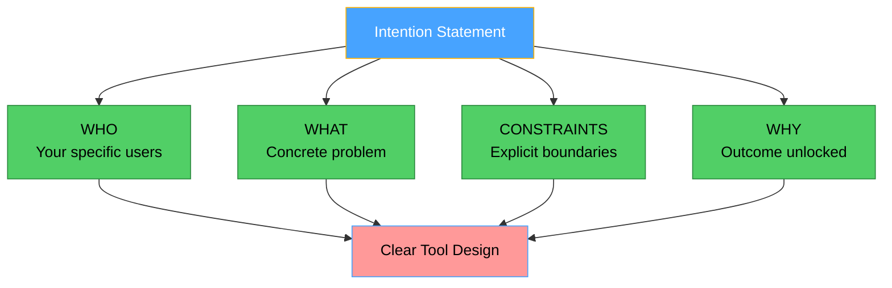

In this new world of agentic systems, how do we avoid designing systems that create cascading problems on multiple fronts? The answer lies in crafting a clear intention statement before writing a single line of code.

### Intention as a North Star

The intention statement answers four critical questions that guide decisions at every interaction point:

**WHO: Your specific users**

- Not "developers" but "Python developers debugging production issues"
- Not "writers" but "technical writers creating API documentation"
- Not "everyone" but "data scientists exploring datasets"

**WHAT: The concrete problem the tool is meant to solve**

- Not "help with text" but "identify documentation quality issues"
- Not "process data" but "validate API examples in markdown files"
- Not "analyze code" but "explain Python function behavior with examples"

**CONSTRAINTS: Very explicit boundaries and conditions**

- Read-only vs. write operations
- Specific file types or formats
- Performance limits (e.g., "files under 1MB")
- Security boundaries (e.g., "no execution of user code")

**WHY: The precise, measurable outcome unlocked**

- Not "make things better" but "reduce documentation-related support tickets"
- Not "save time" but "catch breaking changes before deployment"
- Not "improve quality" but "ensure all code examples actually run"

### Examples of strong intention statements

**Strong**: "Help Python developers (WHO) understand function behavior in their codebase (WHAT) by analyzing source code without execution (CONSTRAINTS) so they can debug issues faster (WHY)"

This gives you:

- Clear tool boundaries (analyze, don't run)
- Specific user language (Python terminology)
- Measurable outcome (faster debugging)

**Strong**: "Enable technical writers (WHO) to validate their API documentation (WHAT) by checking examples against OpenAPI specs (CONSTRAINTS) so readers trust the docs (WHY)"

This prevents:

- Feature creep into general writing tools
- Confusion with code linters
- Vague "improve documentation" goals

**Weak**: "Make text processing easier for users"

- Which users? What text? What processing?
- No boundaries

### The specificity test

Ask yourself:

1. Could another developer read this and build roughly the same tool set?
2. Would an LLM know when to recommend this server?
3. Can feature requests that don't fit be immediately rejected?
4. Is it self-evident what user success looks like?

If any answer is "no," the intention needs sharpening.

### Red flags in intention statements

- **Hedge words**: "various", "multiple", "flexible", "any"
- **Vague outcomes**: "better", "easier", "improved"
- **Missing constraints**: No boundaries = infinite scope
- **Everyone problems**: "all developers" = no one's specific need

The intention statement becomes a North Star. Every decision flows through it. Every feature request tests against it. Every tool definition and error messages reflect it.
