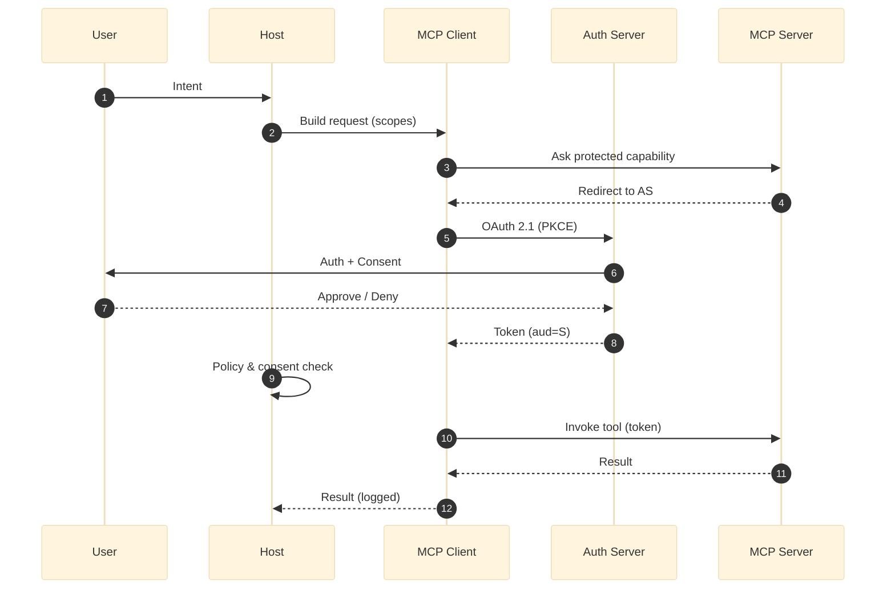

In the [[model context protocol|Model Context Protocol]] (MCP), **consent** is the foundational [[mcp security|security]] mechanism that governs how to delegate authority to [[AI agent|AI agents]]. It ensures any actions they take are authorized, traceable, and revocable. Think of consent as a detailed, enforceable contract that spells out exactly what agents can do on the user's behalf, going far beyond simple permissions.

## tl;dr

Here’s what consent in MCP covers:

- **Granular Delegation**: Permissions are defined with a high degree of specificity. For example, an agent may be authorized to "send a specific email to a designated recipient" rather than having a general permission to "send emails to any contact."
- **Multi-layer Authorization**: Security is enforced through multiple checkpoints, including agent identity verification, user authentication, MCP server access controls, and upstream service permissions.
- **Explicit Scope**: Every grant of permission clearly defines the delegator, the specific agent, and the exact purposes for which the authority is granted, thereby prohibiting overly broad or undefined permissions.
- **Revocability and Auditability**: Users retain the ability to revoke permissions at any time. All actions are logged to provide a clear and auditable trail of agent activity.
- **Distributed Enforcement**: The defined rules are consistently enforced across all components of the system, including [[MCP host|MCP Hosts]], [[MCP client|Clients]], and [[MCP server|Servers]], to ensure comprehensive security.

> [!NOTE]
> Consent must be crystal clear, trackable, and enforceable. Otherwise, the door to unauthorized actions is wide open.

## The core concept

A core principle of consent in MCP is that it must be explicit and specific, avoiding the ambiguity of a blanket acceptance of terms. The protocol requires a detailed definition of permissions, addressing the following questions:

- **Who** is delegating the authority?
- **To which agent** is the authority being delegated?
- **For what purpose** is the delegation being made?

This level of detail ensures clear lines of responsibility, which is particularly important in environments where multiple agents are operating concurrently.

> [!WARNING]
> Bypassing the explicit consent process can grant [[AI agent|AI agents]] unrestricted access, which may lead to significant liability issues and an erosion of trust in the system.

## The five layers of authentication and authorization

The team at Permit.io [1] breaks this down into a five-layer model that helps clarify the process:

| Layer                           | Description                                                                                    |
| :------------------------------ | :--------------------------------------------------------------------------------------------- |
| 1. **Agent Identity**           | Each AI agent has a unique, traceable identity.                                                |
| 2. **Delegator Authentication** | The user authenticates and establishes their identity.                                         |
| 3. **Consent Delegation**       | The user defines the scope of authority for the agent (actions, conditions, constraints).      |
| 4. **MCP Server Access**        | The agent authenticates to the MCP server, which exposes capabilities consistent with consent. |
| 5. **Upstream Services**        | External APIs respect both the agent’s identity and the user’s delegated permissions.          |
|                                 |                                                                                                |

While consent appears explicitly as Layer 3 (Consent Delegation), it actually serves as the foundational principle that governs the logic and constraints at every other layer. Think of Layer 3 as where consent is formally captured and defined, but its influence extends throughout the entire authentication and authorization chain—from establishing agent identities to validating upstream service access.

## Consent in the authorization flow

MCP's authorization flow is built upon the mandatory implementation of the OAuth 2.1 standard, extending it with stricter, more dynamic requirements to handle agent-based interactions securely. The base process looks familiar:

1. The [[MCP client]] requests access to a protected server.
2. The [[MCP server|server]] redirects the request to an authorization server.
3. The authorization server authenticates the user and requires explicit consent for the requested permissions.
4. Upon approval, an access token is issued to the client.
5. The MCP client uses this token to access the protected resource.

However, MCP adds several mandatory extensions to this flow that are optional in standard OAuth, including dynamic server discovery (RFC 9728 & 8414), the use of a `resource` parameter to bind tokens to a specific server (RFC 8707), and strict token audience validation.

> [!Note] **Note on the diagram**:
> This is a simplified view. A full MCP flow would also include mandatory metadata discovery steps where the Client dynamically learns the Authorization Server's endpoints from the MCP Server before step 5.

The official spec [2] and best practices [3] are clear: consent **cannot be skipped**. Every dynamically registered client needs explicit approval.

## Principles of consent

- **Granularity**: Get specific with permissions. Think "send an email to John about the budget meeting" instead of just "send emails," which could lead to unintended outcomes.
- **Revocability**: You should be able to withdraw consent whenever you want, giving you control over your agents.
- **Auditability**: Everything is logged for later review, which is helpful when you need to understand why an agent took a specific action.

These principles help avoid classic security issues like the _confused deputy problem_, where an agent is tricked into misusing its authority.

## Consent as a security control

Explicit consent serves as a primary defense against significant security vulnerabilities:

- **Confused Deputy Attacks**: This prevents servers from using the authority you granted for one purpose for a completely different one.
- **Consent Bypass**: The spec is clear: Hosts **MUST** get consent for every dynamically registered client before allowing third-party access. No exceptions [2]. This is critical for mitigating attacks where a previously granted consent cookie for a static client ID could be maliciously reused to authorize a new, attacker-controlled client without the user's knowledge.

With strict scope enforcement, MCP seriously reduces the chances of agents performing unauthorized actions.

## Conclusion

Consent in [[model context protocol|MCP]] is the foundation that keeps the system secure and accountable. With explicit, granular, and auditable permissions, it is possible to stay in control of what agents can do. This approach builds on the proven foundation of OAuth 2.1, extending it to protect against both classic web security threats and new AI-specific risks.

---

## References

[1] [Permit.io — The Ultimate Guide to MCP Auth](https://www.permit.io/blog/the-ultimate-guide-to-mcp-auth)

[2] [MCP Specification: Authorization](https://modelcontextprotocol.io/specification/draft/basic/authorization)

[3] [MCP Specification: Security Best Practices](https://modelcontextprotocol.io/specification/draft/basic/security_best_practices)
