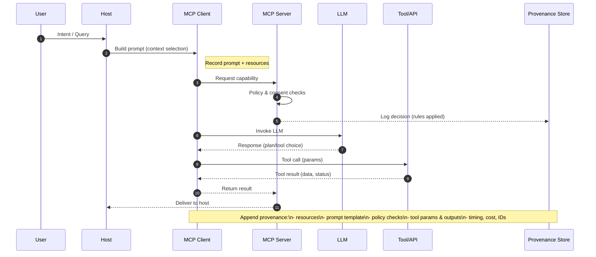

In today's complex AI landscape, **provenance** in the [[model context protocol|Model Context Protocol]] (MCP) is the mechanism that ensures transparency and accountability. It functions as a detailed history for AI workflows, tracking the origin of data, the transformations it undergoes, and the actions performed by [[AI agent|AI agents]]. This comprehensive audit trail is essential for understanding an agent's decision-making process, tracing data lineage, and demonstrating compliance with [[mcp security|security]] and regulatory requirements.

## tl;dr

Here’s what provenance in MCP keeps track of:

- **Resource Origins:** Provides clear documentation of where context originates, whether from databases, APIs, files, or other MCP servers.
- **Prompt and Context Usage:** Records exactly which resources and templates were used to construct the prompts sent to LLMs.
- **Action Trail:** Maintains a complete record of when, why, and how actions occurred, including all policy checks and validations.
- **Authorization and Consent:** Logs who authorized an action, user or a policy, and under what conditions, linking directly to the principles of [[mcp consent|consent]].
- **Decision Transparency:** Offers detailed records of all interactions between [[MCP client|Clients]], [[MCP server|Servers]], and [[MCP host|Hosts]], making it possible to reconstruct the decision-making process.

> [!NOTE]
> To be effective, provenance data must be immutable and, for enterprise applications, cryptographically verifiable to satisfy compliance and security standards.

## The core concept

MCP provenance is more than logging: it is a structured audit mechanism that captures the entire lifecycle of an agent's decision-making process and action journey of agents:

- from user query,
- to context gathering,
- to tool selection,
- to final outcome.

As the team at Secoda notes, MCP can act as a control plane that bundles model calls with data lineage, policy rules, and provenance tracking, ensuring that governance travels with the workflow at every step [1].

> [!WARNING]
> Operating without a robust provenance system is equivalent to flying blind in a complex AI environment. It significantly complicates compliance audits and incident investigations when issues inevitably arise.

## Key components

The following components are central to establishing a comprehensive provenance trail in MCP:

| Component                     | Description                                                                                                                     |
| :---------------------------- | :------------------------------------------------------------------------------------------------------------------------------ |
| **Data Lineage**              | Tracks the origin and flow of data through the system, answering the critical question: "Where did this context come from?"     |
| **Policy Rules**              | Integrates usage constraints and governance directly into the workflow’s context, streamlining compliance.                      |
| **Audit Trail**               | Provides a chronological record of every tool call, parameter, and outcome, creating a detailed log of all activities.          |
| **Decision-Level Provenance** | Moves beyond simple event logging to capture the reasoning behind decisions, connecting policies and context to final outcomes. |

## Modeling provenance: PROV-AGENT

The **PROV-AGENT** framework takes the W3C PROV standard and extends it specifically for agent workflows in MCP [2]. What you get is a unified graph that connects:

- input data,
- agent actions,
- decisions,
- and workflow results.

This integrated view allows developers and auditors to trace errors back to their source, verify accountability, and analyze how decisions propagate across multiple servers and agents.

## Decision-level provenance: MindGuard

The **MindGuard** research project introduces **Decision Dependence Graphs (DDGs)**, which model the reasoning process of LLM agents [3]. By mapping how different concepts influence an agent's decisions, DDGs can be used to detect anomalies such as **Tool Poisoning**, where malicious metadata is used to manipulate an agent's behavior.

## Provenance for enterprise compliance

For enterprise deployments of MCP, provenance is critical for meeting compliance standards like GDPR, HIPAA, and SOX. A robust provenance system provides auditable records of:

- **Initiator Information**: Who triggered an action.
- **Timestamps**: Full lifecycle timing for every event.
- **Tool & Server Details**: Which tools and servers were invoked.
- **Parameters**: The exact inputs used in a tool call.
- **Outcomes**: The results returned by an action.
- **Performance Data**: Metrics such as execution time and cost.
- **Correlation IDs**: Unique identifiers for cross-system auditing.

While MCP does not automatically ensure compliance, its support for immutable and auditable trails provides organizations with the necessary tools to demonstrate adherence to regulatory requirements and effectively investigate any deviations [4].

## Conclusion

Provenance in [[model context protocol|MCP]] is absolutely critical for building **trustworthy, transparent, and accountable [[AI system|AI systems]]**. By combining data lineage, audit trails, and decision-level tracking, it provides both technical and compliance teams with the tools needed to verify that AI agents are operating as intended. As agents become more autonomous, a strong provenance foundation will be essential for ensuring that enterprise MCP deployments run smoothly and securely.

---

## References

[1] [Secoda: Model Context Protocol Explanation](https://www.secoda.co/glossary/model-context-protocol-mcp)

[2] [PROV-AGENT: Unified Provenance for Tracking AI Agent Interactions in Agentic Workflows](https://arxiv.org/html/2508.02866v2)

[3] [MindGuard: Decision Dependence Graphs for Tool Poisoning Detection](https://arxiv.org/html/2508.20412v1)

[4] [Ithena: MCP Audit Trails & Enterprise Compliance](https://www.ithena.one/blog/mcp-audit-trails)
