Picture this: It's 3 AM, and your production Kubernetes cluster is experiencing issues. Instead of frantically jumping between kubectl, Grafana, and log aggregators, you simply ask your AI assistant: "Why is production slow?" Within seconds, you get a complete analysis, root cause identification, and actionable remediation steps. Science fiction? Maybe. But maybe this is exactly the sort of tooling being built with [[model-context-protocol|MCP]] servers today.

So buckle up for a walk-thru of a hypothetical use-case scenario that will highlight the type of deep enterprise value that can be unlocked by using an MCP server to effectively surface existing APIs. Hopefully it will spark ideas for you. Some implementation guidance at the end.

## Discussions

In case you want to jump into discussions about this article, go straight here:

- [LinkedIn discussion](https://www.linkedin.com/feed/update/urn:li:activity:7353508399105368064/)

## The challenge: infrastructure complexity at scale

Modern enterprises run multiple Kubernetes clusters across development, staging, and production environments. DevOps teams spend countless hours drinking coffee. And also:

- Correlating logs and metrics across distributed systems
- Manually investigating performance issues
- Planning deployments while trying to predict their impact
- Writing and maintaining disaster recovery runbooks
- Translating technical metrics into business impact

What if any part of this process could be more fully automated?

## Enter MCP: building context-aware infrastructure tools

The Model Context Protocol enables us to create sophisticated server implementations that can go way beyond simple API wrappers. In our case, it is up to us to decide whether to expose Kubernetes APIs to the AI, or go beyond that and design an intelligent layer that:

- Understands individual metrics and also relationships between services
- Correlates information across multiple clusters and data sources
- Provides data retrieval, but also analysis
- Suggests solutions based on historical patterns and best practices

Let's explore how to design such a system, which I'll call the "Kubernetes Intelligence Hub."

## Architecture: from isolated clusters to unified intelligence

Traditional Kubernetes management systems treat each cluster as an isolated entity. Even with centralized control planes and monitoring dashboards in the mix, the cluster remains the core operational unit. In contrast, this example MCP-based approach introduces the possibility of a unified intelligence layer that spans across clusters:


An MCP server doesn't need to be restricted to just forwarding requests. In fact, it is best used to act as an expert system that understands the entire infrastructure landscape.

## Building intelligent tools

Let's examine some tools that make this system more valuable. Each tool represents a complex capability that would typically require an experienced engineer to perform manually.

### 1. Intelligent diagnosis: from symptoms to solutions

**Tool:** `diagnose_cluster_issue`

Instead of requiring specific metrics or pod names, this tool accepts human-readable symptoms and performs comprehensive analysis:

```bash
# Traditional approach
kubectl logs pod-xyz-123 | grep ERROR
kubectl top pods | sort -k3 -nr
# ... lines of correlations ...

# MCP approach
"Users are reporting timeouts" → Complete root cause analysis
```

**What makes it intelligent:**

- Automatically correlates logs, metrics, and events across all relevant services
- Builds causality chains showing how problems propagated
- Ranks potential solutions by likelihood of success
- Provides business impact assessment

**Example output:**

> Timeouts originated from a memory leak in auth-service v2.4.1 deployed 3 hours ago, triggering exponential retry attempts that exhausted the database connection pool within 47 minutes. Root cause: missing connection timeout in retry logic. Immediate fix: rollback auth-service. Long-term fix: implement circuit breaker pattern with exponential backoff...

> Intermittent 503 errors traced to network interface flapping on Node-3, affecting 15% of traffic and triggering client retries that created a 3x traffic multiplier, overwhelming healthy nodes within 12 minutes. Pattern detected across 4 similar incidents. Remediation: cordon Node-3, update network driver, implement retry rate limiting...

> Performance degradation began with new enterprise customer onboarding at 2:15 PM, generating 10x normal API volume and dropping cache hit rate from 94% to 4%, forcing all requests to database and maxing CPU at 98%. Cascade took 6 minutes from first request to full degradation. Solution: implement cache warming for large customers, add auto-scaling triggers based on cache metrics...


> [!tip]
> This tool essentially provides: "Here's what broke, here's why, here's how to fix it".

---

### 2. Predictive deployment analysis

**Tool: `analyze_deployment_impact`**

This tool acts as a "what-if" simulator, predicting the ripple effects of changes before they happen:

**Capabilities:**

- Simulates resource consumption based on historical patterns
- Traces dependency impacts through the service mesh
- Identifies potential bottlenecks and failure points
- Provides rollout strategies to minimize risk

**Example scenario:**

```markdown
User: "What happens if we deploy the new API version?"

MCP Analysis:

- Memory usage will increase 40% (based on staging tests)
- Current node capacity insufficient at 70% rollout
- Dependent services B and C will see 15ms latency increase
- Recommended: Pre-scale nodes or use canary deployment with 25% max
```


> [!tip]
> This tool essentially answers: "If I do X, what breaks, where, and why?" - before you actually do X.

---

### 3. Workload optimization engine

**Tool: `optimize_workload_placement`**

This tool acts as an intelligent scheduler that continuously rebalances the infrastructure for optimal performance and cost:

**Smart optimization factors:**

- Actual vs. requested resource usage patterns
- Inter-service communication patterns and latency
- Time-based usage (e.g., scale down dev clusters at night)
- Cost optimization across cloud regions
- Affinity and anti-affinity rules

**Example output:**

> Moving user-service pods from zone-A to zone-B will reduce database latency by 23ms and save $1,200/month. Migration can be completed with zero downtime using this 5-step plan...

> Consolidating dev workloads to 3 nodes during off-hours (8pm-7am) will reduce idle resource costs by $8,000/month. Auto-scaling schedule can be implemented with zero impact to developer productivity using this migration plan...

> Separating API and cache pods to different nodes will eliminate network contention and increase throughput by 40%. Current co-location causes 2.3GB/s internal traffic. Migration achievable during next maintenance window with this anti-affinity configuration...

> Re-packing pods based on actual usage (vs requested resources) will increase cluster utilization from 45% to 78%, freeing up 12 nodes for decommission. Smart bin-packing algorithm can complete redistribution over 48 hours with built-in rollback capabilities...


> [!tip]
> This tool essentially answers: "How should workloads be arranged right now for best results?" - and keeps answering as conditions change.

---

### 4. Disaster recovery automation

**Tool: `generate_disaster_recovery_plan`**

Instead of potentially outdated wiki pages, this tool acts as a chaos engineering expert that proactively builds and tests recovery procedures for every possible failure scenario:

- Identifies all single points of failure
- Creates specific runbooks for each failure scenario
- Tests procedures in simulated environments
- Calculates realistic RTO/RPO for each scenario

**Example output:**

> Zone-A failure will trigger automatic traffic redistribution to Zone-B within 30 seconds, with replica scaling increasing capacity by 50%. On-call alerts fire immediately while data sync verification ensures zero data loss. Full recovery achievable in under 2 minutes using this tested runbook...

> Database primary failure initiates automated failover completing in 45 seconds for all services except analytics, which requires manual repointing due to direct connection strings. Total recovery time: 3 minutes. Detailed runbook includes specific commands and validation steps...

> "Auth-service failure creates a cascading impact affecting 12 dependent services within 2 minutes. Current architecture lacks circuit breakers, causing complete system degradation. Mitigation plan implements service mesh circuit breakers with 99.9% failure isolation...

> Configuration rollback via Git revert completes in 5 minutes, but distributed cache invalidation requires manual intervention across 6 cache clusters. Total recovery window: 8 minutes. Automated cache-clear workflow can reduce this to 90 seconds with these implementation steps...


> [!tip]
> This tool essentially provides: "Here's what will break, here's exactly how to fix it, and I've tested it works".

---

### 5. Infrastructure explainability

**Tool: `explain_infrastructure_behavior`**

This tool acts as an intelligent translator between human questions and complex infrastructure behavior, going from "why" questions to actionable understanding.

**What it does:**

- **Answers natural language questions** - Input: "Why is latency high?" not crafting PromQL queries
- **Reconstructs event timelines** - Shows exactly how incidents unfolded instead of only when they occurred
- **Maps service relationships** - Visualizes hidden dependencies and data flows between components
- **Translates to business impact** - Converts technical metrics into revenue loss, affected users, and SLA implications

**Left side - User Questions**: These represent the natural language questions that users typically ask when troubleshooting or understanding their infrastructure. Notice how they're high-level concerns, not technical API queries.

**Center - The MCP (Server) Tool**: The `explain_infrastructure_behavior` tool serves as the intelligent processing layer. This tool understands context and intent, very different from traditional monitoring tools that require specific queries or knowledge of metrics.

**Right side - Intelligent Analysis**: The tool provides actionable insights instead of raw data:

- **Timeline**: Reconstructs the sequence of events that led to an outage, better than just raw log dumps
- **Service Map**: Creates visual understanding of service dependencies and data flow
- **Business Impact**: Translates technical issues into business terms (revenue loss, affected users)

**Example outputs:**

> High latency explained: Frontend pods hitting CPU throttling (95% limit) due to increased JSON parsing load from new API response format deployed at 3:14 PM. Business impact: 23% of checkout attempts timing out, approximately $12K/hour in lost revenue. Root cause chain visualized in attached service map...

> Outage timeline reconstructed: Config change at 3:14 PM removed memory limits → pods consumed all available memory by 3:47 PM → OOM killer terminated critical services → cascading failures reached database by 4:02 PM. Total downtime: 47 minutes. Prevention: implement resource quotas and gradual rollout policies...

> Service dependency analysis reveals hidden coupling: Payment service indirectly depends on inventory service through 3 intermediary services. Recent inventory service latency spikes cause payment timeouts 4 minutes later. Suggested decoupling strategy reduces failure correlation by 85%...


> [!tip]
> A traditional API might tell you CPU is at 95%, but this MCP tool can explain why it matters, what caused it, and how it affects the business.

---

## Real-world workflows

Let's see how this system handles realistic production incident scenarios.

### Workflow 1: automated performance recovery

The sequence diagram shows an automated troubleshooting and remediation workflow where the AI diagnoses performance issues and executes fixes with user approval.

**The Flow:**

1. **Problem Report**: User notices production is slow
2. **Diagnosis**: AI uses the MCP server to analyze the issue across all clusters, discovering memory pressure on pods
3. **Solution Planning**: AI simulates potential fixes to find the safest approach
4. **Execution**: With user approval, AI orchestrates workload redistribution through the MCP server
5. **Resolution**: System automatically recovers to normal performance

```mermaid
sequenceDiagram
    participant User
    participant AI as AI Assistant
    participant MCP as MCP Server
    participant K8s as Kubernetes Clusters

    Note over User,K8s: 🔍 Problem Detection
    User->>AI: "Production is slow today"
    AI->>MCP: diagnose_cluster_issue("slow response times")
    MCP->>K8s: Collect metrics, logs, events
    K8s-->>MCP: Data from all clusters
    MCP-->>AI: Root cause analysis + recommendations
    AI->>User: "Found memory pressure on pods. 3 solutions..."

    Note over User,K8s: 🔬 Impact Analysis
    User->>AI: "What's the safest fix?"
    AI->>MCP: analyze_deployment_impact(scaling_plan)
    MCP->>K8s: Simulate changes
    MCP-->>AI: Impact analysis results
    AI->>User: "Scaling nodes has lowest risk. Want me to proceed?"

    Note over User,K8s: ✅ Execution
    User->>AI: "Yes, do it"
    AI->>MCP: optimize_workload_placement(approved_plan)
    MCP->>K8s: Execute redistribution
    K8s-->>MCP: Migration complete
    MCP-->>AI: Success + new metrics
    AI->>User: "Done! Response times back to normal"
```



**Key Insight**: Traditional performance troubleshooting requires engineers to SSH into nodes, run `kubectl top pods`, check Grafana dashboards, and manually correlate metrics across services. With an [[model-context-protocol|MCP]] server, the entire diagnostic-to-resolution cycle happens through natural conversation. The AI handles the complexity of cross-cluster analysis, impact simulation, and safe workload redistribution, in other words, all tasks that would typically require multiple terminal windows, runbooks, and careful manual coordination.

> [!info] This illustrates how an MCP server can eliminate the tool sprawl and cognitive load of modern infrastructure operations, replacing command-line gymnastics with intelligent automation that understands intent and handles execution safely.

### Workflow 2: post-incident analysis

This Post-Incident Analysis workflow shows how the `explain_infrastructure_behavior` tool helps teams understand what went wrong after an incident.

**The Flow:**

1. **Reconstructs the incident** - Creates a complete timeline showing how a configuration change cascaded into an outage
2. **Identifies gaps** - Explains why existing monitoring missed the issue
3. **Prevents recurrence** - Generates actionable plans to avoid similar incidents

The key difference from Workflow 1 is that this focuses on _understanding_ and _learning_ from past events rather than fixing current issues. The `explain_infrastructure_behavior` tool provides the "why" behind complex infrastructure failures, turning incidents into learning opportunities.

```mermaid

sequenceDiagram
    participant User
    participant AI as AI Assistant
    participant MCP as MCP Server
    participant K8s as Kubernetes Clusters

    Note over User,K8s: 🕵️ Incident Investigation
    User->>AI: "We had an outage yesterday at 2pm"
    AI->>MCP: explain_infrastructure_behavior("outage timeline 2pm")
    MCP->>K8s: Analyze logs, metrics, events
    K8s-->>MCP: Historical data from all clusters
    MCP-->>AI: Causality chain + dependency graph
    AI->>User: "Config update triggered cascade: LB → API pods → DB overload"

    Note over User,K8s: 🔍 Gap Analysis
    User->>AI: "Why didn't our alerts catch this?"
    AI->>MCP: explain_infrastructure_behavior("alert gaps config cascade")
    MCP->>K8s: Analyze monitoring coverage
    MCP-->>AI: Alert blind spots identified
    AI->>User: "Alerts missed cross-service dependencies. 3 gaps found."

    Note over User,K8s: 🛡️ Prevention Planning
    User->>AI: "How do we prevent this?"
    AI->>MCP: generate_disaster_recovery_plan(config_cascade_scenario)
    MCP->>K8s: Simulate failure scenarios
    K8s-->>MCP: Prevention strategies
    MCP-->>AI: Runbook + monitoring improvements
    AI->>User: "Here's your prevention plan with new alerts and rollback procedures"
```



**Key Insight**: The `explain_infrastructure_behavior` tool can transform post-mortems from hours of manual investigation into a much faster understanding. Traditional approaches require engineers to correlate timestamps across dashboards, grep through logs, and mentally reconstruct failure chains. With an MCP server and properly designed tools, we can just ask "what happened?" and get a complete causality analysis. Not needed (from the user standpoint): SQL queries against metrics databases, manual timeline building, guessing at dependencies.

> [!into] This demonstrates how an MCP server can turn infrastructure into a conversational partner that can explain its own behavior, making every engineer as effective as the most experienced SRE in an organization, well-equipped tounderstand complex system failures.

## Implementation insights

When building your own MCP server for infrastructure management, consider these key principles:

1. **Design for intelligence, not just access**

- Posible: Just wrap kubectl commands.
- Better: Build tools that understand relationships, patterns, and context. ✅

2. **Aggregate and correlate**

- Your MCP server should pull from multiple sources (metrics, logs, events, configs) and correlate them intelligently.

3. **Provide analysis, not raw data**

- Possible: Return JSON dumps.
- Better: Return insights and recommendations. The AI can then communicate these naturally to users. ✅

4. **Build in safety**

- Include simulation and validation in your tools. The `analyze_deployment_impact` approach, for example, is designed to prevent costly mistakes.

5. **Think in workflows**

- Design tools that work together. Diagnosis should flow naturally into impact analysis and then execution.

## The business impact

As you experiment and implement workflows using MCP server tools to manage Kubernetes clusters, consider tracking these metrics:

- **% reduction** in mean time to resolution (MTTR)
- **% fewer** production incidents (due to predictive analysis)
- **% reduction** in time spent on routine investigations
- **Democratized expertise**: Junior engineers become as effective as seniors

## Getting started

Suggestions to build your own Kubernetes Intelligence Hub:

1. **Start with one cluster**: Build and test your MCP server against development first
2. **Focus on one workflow**: Perhaps start with the diagnosis tool
3. **Iterate based on real incidents**: Each production issue can teache you what to automate next
4. **Measure impact**: Track MTTR and incident frequency to prove value

## The future of infrastructure management

The MCP protocol enables a fundamental shift in how we interact with infrastructure. Instead of learning dozens of tools and commands, engineers can focus on solving business problems while AI handles the complexity of modern cloud-native systems.

Hopefully the Kubernetes Intelligence Hub example ignited ideas for more than just one possibility. If your work is managing databases, serverless functions, or edge computing infrastructure, consider how MCP implementations can provide the means to build intelligent, context-aware tools that transform operations.

What other complex infrastructure workflows would you automate using MCP? The possibilities are limited only by our imagination!

---

Want to learn more about MCP? I have listed some [[model-context-protocol|MCP resources]] that might be of help.
