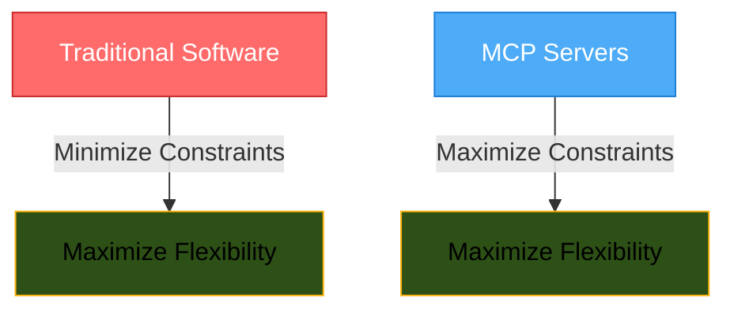
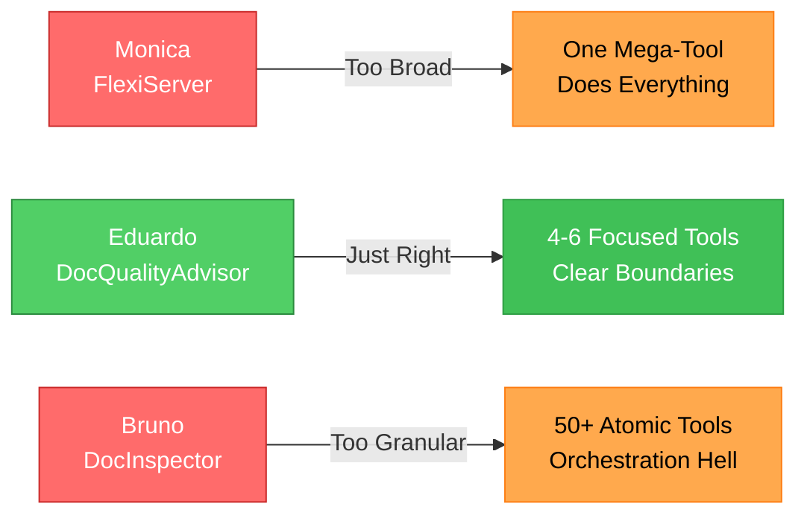
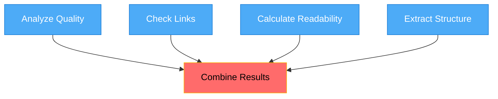
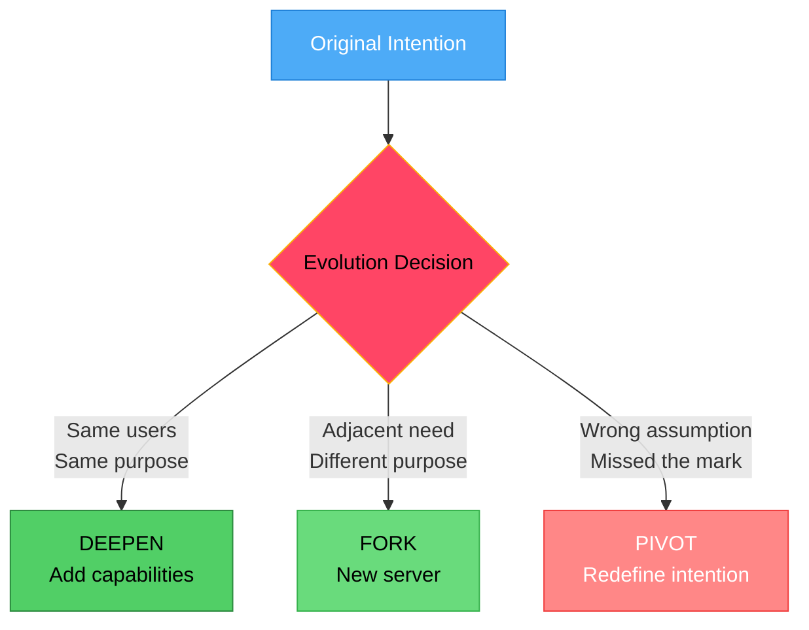

## The paradox of building with AI in the loop

As modern software engineers, we're trained in the agile way: ship fast, iterate based on feedback, let design emerge. We start minimal and evolve based on what we learn from users.

But architecting robust, performant, and useful [[model-context-protocol|MCP]] servers demands the opposite: with LLMs in the loop, the system's effectiveness is significantly improved by intentionally and explicitly defining constraints upfront. These constraints improve the predictability, discoverability, and usability of our tools. Why?

Because for an LLM to make reasonable choices, it must be carefully guided. They can't read between the lines, infer unstated intentions, or choose between multiple paths to the same goal. They work purely with (their interpretation of) what we explicitly provide. The [[context-engineering|context]] we give them becomes their entire universe of what's possible.

> [!TIP] Because LLMs rely heavily on clarity, precision, and explicit structure, defining intentional constraints upfront is critical.

This fundamentally shifts how we measure success. Instead of evaluating how fast we ship and iterate, now we prioritize testing how reliably our constraints allow LLMs to discover and effectively compose our tools.

> [!INFO] The Constraint Paradox
>
> - Traditional software development: minimize constraints, maximize flexibility
> - MCP server development: maximize constraints, maximize flexibility
>
> The clearer our constraints, the more confidently LLMs can compose our tools into helpful solutions.

A competitive landscape amplifies this new reality. Given the great usability that MCP provides, users are able to seamlessly switch between different servers and tools. And, as the ecosystem matures, they will have an increasing number of options from which to choose.



Instead of thinking of this as me suggesting to abandon agile principles 😱, I'd rather 🙏 you saw it as a realization that building with AI in the loop has different rules. Where traditional software rewards emergent flexibility, MCP servers reward intentional constraints.

Absolutely nothing wrong about yolo'ing your way thru your first MCP servers. I'm just wanting to tell you [when I did that](https://github.com/carlisia/mcp-factcheck), I had to reel myself back from a much deeper abyss than it was fun (or profitable) for me, all because I didn't have this guide that is now in front of your eyeballs! 👁👁

What follows is a practical framework for architecting MCP servers that embraces constraints and upfront intention as competitive advantages. I'll share concrete pointers for how to architect MCP servers intentionally enough to get considerable gains 💪 quickly, but not so much that it doesn't feel playful or experimental or productive.

As my Gen Z kid says: "**Trust**."

> [!TIP] PS:
> The core principles I discuss here apply to agentic systems in general, not only MCP servers/tools.

> [!WARNING]
> No developer soul is meant to be hurt in the process of reading this article. While I know **no one** would architect a system in the way of some of the examples here, they are still very useful for the contrast needed to highlight the new (old?) thinking for building useful agentic systems.

> [!TIP] PS 2:
> This article helps developers design agentic systems/MCP servers that LLMs can use effectively. Security patterns are orthogonal to the usability patterns I'm covering here, they have a different intention (protecting systems from misuse) and deserve they own focused treatment. They were left out on purpose.

> [!TIP] PS 3:
> I don't show you in this article how to plug business logic and tool definitions into the MCP API handlers. It is out of scope for this article. I find it actually quite trivial (especially with SDKs) once you sort out what is business logic from what is "hook up" code.

## Why MCP makes clear intention so very critical

When developers encounter an unexpected behavior with a tool, we experiment, ask questions, read code, read the logs, read docs. I'm kidding!!! We never read the docs.

When machines (you know, the regular kind) encounter unknown inputs, they follow their programming: retry, retry with different options, follow alternative logic paths, or fail gracefully with error codes. How deterministic of them.

When LLMs encounter a vaguely described tool with seemingly ambiguous parameters, they will either:

- Bypass the tool entirely (missing its value)
- Misuse it with wrong parameters (wasting tokens)
- Chain it incorrectly with other tools (breaking workflows)

### The impact varies by client type

The unintended impact from tools designed with vague intentions manifests differently based on the type of MCP client.

#### When humans are in the loop

- Every interaction tests clarity: ambiguous tools lead to failed attempts and user frustration
- Trust compounds or erodes with each use: consistent behavior builds confidence, unpredictability drives users away
- Users develop workarounds for what works, building fragile patterns around specific tool quirks

#### When MCP clients are agents

- Failure modes cascade silently: agents propagate errors downstream without correction
- Integration assumptions become permanent contracts: some agent developers might hard-code expectations that break with any change
- Latency compounds dramatically: unclear tools trigger multiple attempts with different parameters, multiplying both time and token costs
- There's no forgiveness: agents interpret tools literally, without human ability to infer intent

### Tool metadata: what LLMs actually see

When we build an [[model-context-protocol|MCP]] server, our primary users are LLMs. These "users" must:

- Select appropriate tools based solely on metadata
- Reason about when and how to use them
- Compose them into solutions
- Work within [[context-engineering|context]] window limits

If there is ONE THING that LLMs are terrible at, it's handling ambiguity. Clear metadata is what enables confident tool selection. Vague metadata, then, forces expensive experimentation on the part of the LLMs.

#### Clear metadata with intentional boundaries

```json
{
  "name": "search_documents",
  "description": "Search markdown documents by content or title",
  "inputSchema": {
    "type": "object",
    "properties": {
      "query": {
        "type": "string",
        "description": "Search term to find in documents"
      },
      "searchIn": {
        "type": "string",
        "enum": ["content", "title", "both"],
        "description": "Where to search"
      }
    },
    "required": ["query"]
  }
}
```

#### Vague metadata that hurts LLM usage

```json
{
  "name": "process", // Process what?
  "description": "Processes data", // How? What kind?
  "inputSchema": {
    "type": "object",
    "properties": {
      "data": {
        "type": "string",
        "description": "The data" // What format? What content?
      },
      "mode": {
        "type": "string", // What are valid modes?
        "description": "Processing mode"
      }
    }
  }
}
```

The difference:

- **Clear**: LLMs know exactly when to use `search_documents` and what parameters to provide
- **Vague**: LLMs must guess what "process" does, what "modes" exist, and what "data" format is expected

> [!SUCCESS] Beyond this point, I will demonstrate how to use intention to define boundaries, enable composition, and guide evolution.

## The intention statement framework for agentic systems

The beauty of MCP development is we can start with a single tool and grow from there. We don't need a 50-page specification (didn't I tell you to trust??!). For maximum precision in your intention, I suggest using [[the-intention-statement-framework-for-agentic-systems|The agentic intention framework]] to define it more completely, and before you write any code:

```markdown
This MCP server helps [WHO] to [DO WHAT] with [WHAT CONSTRAINTS]
so that [WHY THIS MATTERS]
```

Examples:

- "This MCP server helps **individual developers** to **manage their personal notes** with **minimal friction** so that **context-switching doesn't kill productivity**"
- "This MCP server helps **SREs** to **debug production issues** with **read-only access** so that **they can find root causes without risking further damage**"
- "This MCP server helps **data analysts** to **explore CSV files** with **read-only safety** so that **they avoid costly accidental data corruption**
- "[This MCP server](https://github.com/carlisia/mcp-factcheck) helps **developers and technical writers** to **validate any MCP-related content against official specifications** with **strict adherence to official definitions on a per-version basis** so that **they can have high confidence that MCP-related content they read or write is free from misinformation**"

> [!TIP] Note: The devil is in the precision.

Here's how to know if your intention is strong:

- **Weak intention**: "This server processes log files" (missing WHO and WHY)
- **Strong intention**: "This server helps SREs to debug production issues faster so that they can reduce system downtime"

**Test**: Can you measure if you're succeeding?

- Processing log files → What does success look like? Who benefits? Why does it matter?
- Helping SREs debug production issues → Measurable: time to root cause, escalation rates, downtime minutes ✓

> [!SUCCESS] Tip
> I personally always start with the WHY, then play with the WHAT and WHO interchangeably.

## A tale of three MCP servers

Let me tell you about Eduardo and Monica (😬 if you know, you know, lolz), and Bruno, three developers who learned this lesson very differently.

> [!HELP] Keep in mind:
> A tool (handler) can either contain all the code to be executed or simply call another function that serves as an entry point for the actual work. Below, I’m showing only these entry-point functions.

### Monica's FlexiServer: why just one thing?

Monica built FlexiServer, aiming to create the "Swiss Army knife of MCP servers" that could handle text processing tasks, and be extensible:

```go
type OperationType string // stringly-typed
type ProcessConfig map[string]any // a grab bag
type ProcessResult struct {
    Data interface{} `json:"data"` // returns anything
    Type string      `json:"type"` // requires interpretation
}

// Process executes any text processing operation based on the operation type.
// The config parameter requirements vary by operation.
// Returns ProcessResult whose structure depends on the operation.
func Process(input string, operation OperationType, config ProcessConfig) (*ProcessResult, error)

// Apply runs a processing pipeline on text.
// Each step is executed in sequence with the output of one feeding the next.
// Returns a PipelineResult whose structure varies based on the final step.
func Apply(text string, steps []PipelineStep) (*PipelineResult, error)

// Execute performs text operations based on natural language commands.
// Interprets commands like "make this shorter" or "find key points".
// Returns an ExecutionResult with command-specific structure.
func Execute(content string, command NaturalCommand) (*ExecutionResult, error)

// Transform modifies text based on the provided ruleset.
// Rules can be regex patterns, templates, or custom transformers.
// Output structure depends on the rule type applied.
func Transform(input TextInput, rules TransformRules) (*TransformOutput, error)

// RegisterExtension adds new processing capabilities at runtime.
// Extensions are identified by ExtensionID like "sentiment" or "translate.spanish".
func RegisterExtension(id ExtensionID, handler ExtensionHandler) error
```

With unconstrained flexibility and ambiguous interface definitions, this design creates uncertainty for LLM usage:

• **Tool selection token burn** - With `Process`, `Execute`, and `Transform` all modifying text, LLMs waste tokens reasoning through which to use and explaining their choice to users

• **Configuration discovery overhead** - `ProcessConfig map[string]any` forces trial-and-error. Each failed attempt adds request + error + retry reasoning to the [[context-engineering|context]] window

• **Verbose operation explanations** - Since `OperationType` values like "enhance" have no clear meaning, LLMs burn tokens explaining what they _think_ might happen

• **Compound ambiguity costs** - `Execute` with natural language commands like "make it better" requires tokens for: interpreting the command + explaining uncertainty + handling unpredictable results

• **Runtime capability confusion** - `RegisterExtension` means LLMs can't cache which operations exist, requiring fresh discovery and adding explanation tokens each session

• **Error cascade verbosity** - When `Process` fails due to wrong config keys, the LLM needs tokens to explain the error, guess correct parameters, and retry

• **Result interpretation overhead** - With `ProcessResult.Data interface{}`, LLMs waste tokens explaining what type of data they received and how they're interpreting it, instead of just presenting results

> [!NOTE]
> The flexible design undermines reliability at every stage: selection (ambiguous boundaries), execution (unpredictable behavior), and integration (inconsistent outputs).

### Bruno's DocInspector: bring my own APIs, all of them

Bruno built DocInspector. He already had a comprehensive REST API for document analytics, so his intention was simple: be efficient and reuse all 47 existing endpoints by mapping each one directly to an MCP tool. Why reinvent the wheel when the APIs were already tested and deployed?

```go
// DocumentWordCount returns the total word count
func DocumentWordCount(path string) (int, error)

// DocumentCharacterCount returns the total character count
func DocumentCharacterCount(path string) (int, error)

// DocumentLineCount returns the total line count
func DocumentLineCount(path string) (int, error)

// DocumentParagraphCount returns the total paragraph count
func DocumentParagraphCount(path string) (int, error)

// DocumentHeading1Count returns count of H1 headings
func DocumentHeading1Count(path string) (int, error)

// DocumentHeading2Count returns count of H2 headings
func DocumentHeading2Count(path string) (int, error)

// DocumentCodeBlockCount returns count of code blocks
func DocumentCodeBlockCount(path string) (int, error)

// DocumentPythonCodeBlockCount returns count of Python code blocks
func DocumentPythonCodeBlockCount(path string) (int, error)

// DocumentJavaScriptCodeBlockCount returns count of JavaScript code blocks
func DocumentJavaScriptCodeBlockCount(path string) (int, error)

// CheckDocumentHasTableOfContents returns true if doc has a TOC
func CheckDocumentHasTableOfContents(path string) (bool, error)

// CheckDocumentHasIntroduction returns true if doc has an intro section
func CheckDocumentHasIntroduction(path string) (bool, error)

// DocumentReadingTimeInSeconds returns estimated reading time
func DocumentReadingTimeInSeconds(path string) (int, error)

// DocumentFleschScore returns Flesch readability score
func DocumentFleschScore(path string) (float64, error)

// ... 30+ more ultra-specific tools
```

With excessive granularity and fragmented operations, this design creates orchestration overhead for LLM usage:

• **Tool discovery overhead** - Before executing any request, LLMs must parse and evaluate 50+ tool definitions (each 100-200 tokens), consuming 5,000-10,000 tokens just to understand available capabilities

• **Orchestration complexity** - A "document analysis" request requires the LLM to construct a directed acyclic graph of 15-30 tool calls, reason about dependencies, and maintain execution order

• **Context window exhaustion** - Each tool call adds ~200-500 tokens (request + response + reasoning). A 20-tool sequence consumes 4,000-10,000 tokens in intermediate state alone, leaving insufficient room for document content

• **Latency amplification** - Serial dependencies prevent parallelization. If ReadingTimeInSeconds depends on WordCount, and FleschScore depends on both, you have a critical path of 3+ sequential round-trips

• **High failure surface area** - More tools mean more failure points. When tool 15 of 20 fails, the LLM must decide whether partial results are acceptable or if the entire analysis is compromised

• **Semantic ambiguity at scale** - LLMs must infer relationships between `DocumentHeading1Count`, `DocumentHeading2Count`...`DocumentHeading6Count` versus a single `DocumentHeadingStructure` that returns hierarchical data

> [!NOTE]
> The atomic design degrades user experience at every stage: selection (overwhelming choices), execution (excessive latency), and integration (fragmented results).

### Eduardo's DocQualityAdvisor: why so picky?

Eduardo built DocQualityAdvisor. He had one precise intention: help developers understand and improve their documentation quality with clear, actionable feedback, so that their tools become reliably discoverable and easy to use:

```go
// AnalyzeDocumentationQuality examines technical documentation for common quality issues
// including missing sections, unclear explanations, and structural problems.
// Use this to get specific improvement recommendations for developer documentation.
// Returns a QualityReport with scored issues and actionable suggestions for each problem found.
func AnalyzeDocumentationQuality(path string) (QualityReport, error)

// CheckLinkValidity validates all links in documentation, identifying broken links,
// redirects, and invalid anchor references. Use this to ensure all references work correctly.
// Set checkExternal to true to also validate external URLs (slower but more thorough).
// Returns a LinkReport containing broken links, redirect chains, and anchor mismatches.
func CheckLinkValidity(path string, checkExternal bool) (LinkReport, error)

// CalculateReadabilityMetrics analyzes text complexity and reading difficulty.
// Use this to ensure documentation matches your target audience's reading level.
// Returns grade level, estimated reading time, and technical jargon density.
func CalculateReadabilityMetrics(path string) (ReadabilityMetrics, error)

// ExtractDocumentStructure parses the hierarchical organization of a document.
// Use this to analyze navigation flow and identify structural issues like
// missing sections or imbalanced content depth.
// Returns a DocumentStructure with heading hierarchy, section balance, and navigation tree.
func ExtractDocumentStructure(path string) (DocumentStructure, error)
```

With intentional constraints and boundaries, this design optimizes for LLM efficiency:

• **Deterministic tool selection** - Names like `CheckLinkValidity` and `CalculateReadabilityMetrics` create clear decision boundaries, minimizing selection tokens because LLMs don't need exploratory reasoning

• **Zero overlap design** - Each tool owns exclusive functionality (links OR readability OR structure), preventing token waste because LLMs never compare similar tools

• **Predictable parameter contracts** - Fixed, typed parameters like `(path string, checkExternal bool)` eliminate configuration discovery overhead because LLMs can see exactly what's required from the schema

• **Structured return types** - `LinkReport`, `ReadabilityMetrics` provide consistent schemas, allowing direct result formatting because LLMs know the exact structure in advance

• **Composability without coupling** - Tools can be called independently or together, enabling simpler orchestration because there are no hidden dependencies between tools

• **Context window efficiency** - Clear, focused tools need minimal description tokens while providing maximum clarity because each tool does one thing well

> [!NOTE]
> The design optimizes for LLM effectiveness at every stage: selection (obvious choice), execution (predictable behavior), and integration (composable results).

### Six months later

**Monica's FlexiServer:**

- 47 open GitHub issues: "Process returns string but AI expects array", "What does operation='enhance' actually do?", "ProcessConfig completely undocumented"
- Monica spends more time explaining parameter combinations than adding features
- 3 frustrated blog posts: "Why I Gave Up on MCP After 2 Weeks"
- Average token usage: 3x higher due to LLMs repeatedly guessing valid combinations

**Bruno's DocInspector:**

- 12 open issues: "Why does analyzing a document require 47 API calls?", "Timing out after 30 seconds"
- Bruno's server works perfectly for direct API users, but fails for LLM interactions
- One viral tweet: "MCP servers: Death by a thousand tool calls"
- 90% of users only use the newly added `AnalyzeDocument` aggregate tool

**Eduardo's DocQualityAdvisor:**

- Integrated into 4 major documentation platforms
- Pull request: "This is exactly what we needed, each tool does one thing perfectly!"
- Featured in MCP showcase: "Example of thoughtful MCP server design that LLMs love"
- Community fork expanded it following the same easy to follow [[the-intention-statement-framework-for-agentic-systems|The agentic intention framework]]

The key differences? Eduardo designed for agentic interaction. Monica designed for flexibility. Bruno designed for API reuse.

## The pitfalls of unclear intention

After seeing Eduardo, Monica, and Bruno's six-month outcomes, you might be ready to craft your own clear intention for your MCP servers and tools using [[the-intention-statement-framework-for-agentic-systems|The agentic intention framework]].

But if you're still unconvinced that unclear intentions create real problems, here are specific pitfalls across three critical categories. These aren't theoretical concerns, they're inevitable challenges for LLMs.

### 1) LLM interaction pitfalls

#### a) The tool granularity trap

Without clear intention, developers swing between extremes:

**Too granular** (Bruno): 50+ atomic tools force LLMs to orchestrate complex call sequences for simple requests.

**Too broad** (Monica): Ambiguous mega-tools leave LLMs guessing about parameters, outputs, and chaining behavior.

**Just right** (Eduardo): Each tool serves one specific need with clear boundaries.



#### b) The discovery paradox

The more flexible the tools, the less discoverable they become:

- Monica's "process any text" → When would an LLM choose this?
- Bruno's "get any metric" → Which of 50 tools to call?
- Eduardo's "find quality issues" → Clear purpose, obvious choice

The paradox: trying to be useful for everything makes you useful for nothing specific.

#### c) The composition breakdown

Unclear intention sabotages tool composition, imo [[model-context-protocol|MCP]]'s most powerful feature:

- **Monica**: Unpredictable outputs (`enhance` → ??? → `format` → ???)
- **Bruno**: Excessive orchestration (4 calls for what should be one)
- **Eduardo**: Natural chaining (structured outputs enable parallelization)

Good composition requires:

- Predictable outputs that become inputs
- Independence (tool B doesn't break if tool A fails)
- Clear data flow (obvious what chains with what)

### 2) Technical design pitfalls

#### a) The context window waste

Every token counts, and unclear designs burn them recklessly:

**Discovery**: Bruno's 50+ tool definitions consume 5,000+ tokens before work begins. Monica's vague descriptions require lengthy explanations. Eduardo's focused tools need minimal description.

**Execution**: Bruno needs 20 calls × 200 tokens = 4,000 tokens of orchestration. Monica multiplies tokens through failed attempts and retries. Eduardo uses single-purpose calls with predictable results.

**Results**: Bruno accumulates 20 small results. Monica requires explanation of ambiguous outputs. Eduardo's structured results speak for themselves.

#### b) The hidden dependencies trap

Unclear intention creates non-obvious coupling:

- **Monica**: Runtime registration (`RegisterExtension` before `Process`) creates fragile dependencies
- **Bruno**: Each call depends on previous results, filling [[context-engineering|context]] with intermediate state
- **Eduardo**: Every tool is self-contained and independently callable

The real cost isn't the dependencies themselves, it's forcing LLMs to become more orchestration engines instead of problem solvers, burning tokens on state management rather than solutions.

### 3) Evolution pitfalls

#### The feature creep spiral

Without clear intention, every user feature request seems reasonable:

**Monica's spiral**:

1. "Can `Process` handle JSON?" → Add JSON mode
2. "What about YAML?" → Add YAML mode
3. "Can it validate too?" → Add validation modes
4. "Transform between formats?" → More modes

Result: 47 modes, none work reliably

**Bruno's spiral**:

1. "We need WordCount" → Add endpoint
2. "Also need CharCount" → Add endpoint
3. "And LineCount" → Add endpoint

Result: 50+ endpoints, terrible UX

**Eduardo's triage**:

1. "Can it fix the issues it finds?" → No, that's a different intention
1. "Add markdown-to-HTML conversion?" → No, that's transformation not quality analysis
1. "Add auto-translation?" → No, that's content generation not quality checking
1. "Add plagiarism detection?" → No, that's content verification not documentation quality
1. "Add SEO optimization?" → No, that's marketing not documentation quality

Result: Focused tools that excel at their purpose

Upfront, clear intention is our defense against the feature creep spiral. It gives us clarity and permission to say "that's a great idea for a different MCP server."

## Defining tighter boundaries using intention

The [[the-intention-statement-framework-for-agentic-systems|The agentic intention framework]] can be used as a daily decision-making filter. If every choice we face flows through this framework, we will succeed in keeping our MCP servers focused and effective.

### Scope boundaries

Before writing any code, our intention helps us define what belongs in our MCP server and what doesn't.

#### The Goldilocks test for server scope

**Too broad**: "Help with text processing"

- Can't list 10 specific tools without getting vague
- LLMs can't determine when to use it

**Too narrow**: "Validate Python 3.11 async functions in .md files between 1-5KB"

- Too specific to last 6 months
- Not enough tools to justify a server

**Just right**: "Help developers validate code examples in their documentation"

- Clear tool ideas: ValidateCode, CheckImports, VerifyOutput
- Natural boundaries between validation and fixing
- Room to grow with more languages

#### One server or many?

**Signs we need multiple servers**:

- Different user personas (developers vs. marketing)
- Conflicting constraints (read vs. write)
- No natural workflow between tool groups
- Different core purposes

**Signs we need one server**:

- Tools naturally chain: Parse → Analyze → Report
- Same user persona throughout
- Shared constraints (all read-only, same file types)
- Combined value exceeds individual tools

**Example: Eduardo's decision**

Eduardo considered adding documentation fixing to DocQualityAdvisor:

```
Analyze tools:              Fix tools:
- WHO: Developers          - WHO: Developers ✓
- WHAT: Find issues        - WHAT: Fix issues ✗
- CONSTRAINTS: Read-only   - CONSTRAINTS: Write ✗
- WHY: Understand quality  - WHY: Improve quality ✗
```

Three mismatches = separate server. DocQualityAdvisor finds problems, DocFixer solves them. They chain beautifully but maintain clear boundaries.

#### Scoping features

When requests arrive, we can also run them through the filter:

**Request**: "Can DocQualityAdvisor check Python code examples?"

- WHO: ✓ Developers writing docs
- WHAT: ✓ Quality includes working examples
- CONSTRAINTS: ✓ Still read-only analysis
- WHY: ✓ Reduces documentation issues

**Decision**: Yes, add `ValidateCodeExamples`

### Implementation boundaries

Once we know our scope, intention also guides how we structure our tools.

#### Tool granularity decisions

```go
// Intention: Help SREs debug production issues quickly and safely

// Clear boundaries from intention
func FindErrorPatterns(logs LogQuery) ([]ErrorPattern, error)
// Serves WHO (SREs), enables WHAT (find issues),
// respects CONSTRAINTS (read-only), advances WHY (faster identification)

// Would violate intention
func AutoFixErrors(pattern ErrorPattern) error
// Different WHAT (fixing vs debugging), violates CONSTRAINTS (modifies production)
```

#### Parameter design choices

**Choice**: Return all metrics in one call vs separate tools?

- One call serves "quick overview" (aligns with WHY: fast understanding)
- Separate tools serve "detailed analysis" (aligns with WHAT: thorough checking)

**Decision**: Both: `GetOverview` for quick checks, individual tools for deep dives

### Communication boundaries

Clear communication helps LLMs understand and use our tools effectively.

#### Writing tool descriptions

```go
// Weak: Generic description
"Analyzes text for various metrics"

// Strong: Intention-aligned description
"Analyzes API documentation to identify quality issues that frustrate developers,
including broken examples, missing parameters, and unclear descriptions"
// - Clear WHO: developers reading API docs
// - Clear WHAT: quality issues
// - Clear WHY: reduce frustration
```

#### Error message as guide

```go
// Weak: Technical error
"Error: Invalid parameter type"

// Strong: Intention-guiding error
"Error: Code validation requires a markdown file with code blocks.
Supported languages: Python, JavaScript, Go"
// Reinforces WHAT: validating code in documentation
// Clarifies CONSTRAINTS: specific file types
```

## Composition patterns that work

One of MCP's most powerful features is enabling LLMs to combine tools into solutions. In this section I want to give you ideas for how to craft effective composition patterns.

### Three principles for composable tools

**1. Predictable contracts**
Each tool has clear inputs and outputs. When `AnalyzeDocumentationQuality` returns a `QualityReport`, the LLM knows exactly what fields it contains and can confidently access `.Issues` or `.Score`.

**2. Independent operation**
`CheckLinkValidity` doesn't need `AnalyzeDocumentationQuality` to run first. Each tool is self-contained, taking a document path and returning complete results.

**3. Complementary purposes**
Each tool provides a different lens on the same problem space. Quality analysis, link checking, and readability metrics all contribute to understanding documentation health without overlapping.

### Sequential patterns

Sequential composition creates workflows where each tool's output enhances the next step.

**Pattern: Progressive refinement**

```
AnalyzeDocumentationQuality(doc)
→ identifies missing sections
→ CheckLinkValidity(doc, focus_on_sections=identified_sections)
→ checks links in problem areas first
→ GenerateImprovementReport(quality_results, link_results)
```

**Pattern: Filter and focus**

```
ExtractDocumentStructure(doc)
→ identifies all code blocks
→ ValidateCodeExamples(doc, languages=found_languages)
→ validates only relevant languages
→ CalculateCodeCoverage(validation_results)
```


Each step narrows focus based on previous discoveries, allowing LLMs to explain their reasoning clearly.

### Parallel patterns

Parallel composition leverages independence for efficiency.

**Pattern: Comprehensive analysis**

```
Parallel:
├── AnalyzeDocumentationQuality(doc)
├── CheckLinkValidity(doc)
├── CalculateReadabilityMetrics(doc)
└── ExtractDocumentStructure(doc)

Then: CombineIntoReport(all_results)
```

**Pattern: Multi-perspective validation**

```
For each code example in parallel:
├── CheckSyntax(example)
├── CheckImports(example)
├── CheckOutput(example)
└── CheckComplexity(example)
```



No tool depends on another's output. If one fails, others still provide value, allowing LLMs to optimize for speed without worrying about ordering.

### The role of structured outputs

Structured outputs enable reliable composition. When tools return structured data:

- LLMs know what fields are available
- Results can be filtered intelligently
- Tools can be chained predictably

```go
// Structured output with clear fields for downstream consumption
type QualityReport struct {
    Score           float64
    Issues          []Issue
    MissingSections []string
}

// Organized output - ready for composition
type LinkReport struct {
    BrokenLinks []BrokenLink
    BySection   map[string][]BrokenLink  // Pre-grouped by document section
    BySeverity  map[string][]BrokenLink  // "critical", "warning", "info"
}
```

Each tool can efficiently access the exact subset of data it needs:

- The MCP client asks: "What critical links need fixing in the API docs?"
- LLM combines: `report.BySection["api-docs"]` ∩ `report.BySeverity["critical"]`
- No filtering through hundreds of links needed

### Composition best practices

**1. Design tools that transform, not just extract**

- `AnalyzeReadability() ReadabilityReport` provides rich data for next steps
  - Better than simple `GetWordCount() int`

**2. Organize outputs for easy filtering**
Pre-group data by common use cases (by section, by severity) so downstream tools can efficiently access what they need.

**3. Provide both summary and detail**
Let LLMs choose the appropriate level for their current task.

```go
type QualityReport struct {
    Summary     Summary      // For quick decisions
    Details     []Issue      // For deep analysis
    Suggestions []Suggestion // For next steps
}
```

**4. Use consistent identification**
All tools should use the same parameter names and types for common inputs like file paths.

> [!TIP]
> Useful composition doesn't happen by stacking iterations, it emerges from [[the-intention-statement-framework-for-agentic-systems|clear intentions]], predictable contracts, and precise thinking about how tools can work together.

## When intention meets reality, aka iterations

How do we evolve without losing sight of the intention we started out with? How do we adapt to real needs without becoming Monica's FlexiServer?

### Evolving without losing focus

The key to healthy evolution is treating our intention as a compass, not a cage. It guides direction while allowing for growth. Every successful MCP server evolves, but the ones that thrive do so deliberately.

**Signs of healthy evolution:**

- New tools make existing ones more valuable
- Original users get more power without more complexity
- Each addition serves the core intention better
- LLMs can still explain the server's purpose in one sentence

**Signs of drift:**

- New tools serve different user types
- Original tools feel disconnected from new ones
- We're adding parameters to make tools do double duty
- LLMs hedge when describing what the server does

### The three patterns for evolution: Deepen, Fork, Pivot

#### **1. Deepen (most common)**

Intention stays the same, but we serve it better:

```go
// V1: Help developers understand code
func ExplainFunction(name string) (string, error)

// V2: Same intention, deeper capability
func ExplainFunction(name string, detail Level) (Explanation, error)
func VisualizeCallGraph(name string) (GraphData, error)
func ExplainWithExamples(name string) (ExplanationWithCode, error)
```

Deepening feels natural because:

- Original users get more value
- New tools complement existing ones
- The core intention gets stronger, not diluted

#### **2. Fork (when users pull in new directions)**

Users want something adjacent but different:

```go
// Original: DocQualityAdvisor - helps understand docs
// Users want: "Can it fix the broken links it finds?"

// Wrong: Add fixing to DocQualityAdvisor (breaks read-only constraint)
// Right: Create DocFixer as a sibling server
```

Forking preserves clarity:

- Original server stays focused
- New server has its own clear intention
- They compose beautifully together
- Neither suffers from scope creep

#### **3. Pivot (rare, when intention was wrong)**

Only when we discover our original intention missed the mark entirely:

```go
// Started: "Help developers write better commit messages"
// Discovered: They actually needed "Help developers understand what changed"
// Pivot: Refocus on change analysis, not message writing
```

Pivoting requires honesty:

- Admit the original intention was off
- Define a new, clearer intention
- Potentially rename/rebrand
- Communicate the change clearly



### Version evolution example

Let's follow a server through realistic growth:

**Version 1.0: Personal use**

```
Intention: Help me find security issues in my Node.js projects
Tools:
- FindHardcodedSecrets()
- CheckDependencyVulnerabilities()
- IdentifyInsecurePatterns()
```

**Version 2.0: Team adoption (Deepen)**

```
Same intention, expanded for team needs:
- FindHardcodedSecrets(severity Level)
- CheckDependencyVulnerabilities(includeDevDeps bool)
- IdentifyInsecurePatterns(customRules []Rule)
- GenerateSecurityReport() // New: aggregate findings
```

**Version 3.0: Adjacent need emerges (Fork decision)**

```
Users: "Can it automatically update vulnerable dependencies?"

Decision point:
- Updating != Finding (different WHAT)
- Requires write access (different CONSTRAINT)
- Solution: Fork into SecurityScanner + SecurityFixer
```

Each version deepened value for the original use case without losing focus.

### When to say no

The hardest part of evolution might be saying no to good ideas that don't fit. Here's some guidance:

**Immediate no:**

- Violates core constraints (write access for read-only tool)
- Serves different users (enterprise features for personal tool)
- Requires architecture change (real-time for batch tool)

**Consider forking when:**

- Great idea but different intention
- Would help users but breaks existing patterns
- Valuable but changes core assumptions

**Consider deepening when:**

- Makes existing tools more powerful
- Serves same users better
- Respects all constraints
- Natural extension of current capabilities

**Real example: Eduardo's evolution decisions**

Remember Eduardo's decision to keep "fixing" separate from "analysis"?
Here's how he applied the same filter to feature requests:

```markdown
Request: "Add README template generator" → No, generating != analyzing
Request: "Add API example validation" → Yes, code quality IS documentation quality
```

The filter works consistently: features that serve the core intention get deepened, others get redirected.

## Conclusion: trust the process

We've seen three developers, three approaches, three outcomes. Monica chased flexibility and created confusion. Bruno mapped existing APIs and created fragmentation. Eduardo started with intention and created clarity.

And the difference really wasn't skill or effort, it was mindset and process.

### The path forward

Building [[model-context-protocol|MCP]] servers with AI in the loop requires us to flip our hard-earned instincts. Before we minimized constraints to stay adaptive, to favor continuous flexibility through iteration. Now we maximize constraints upfront to maximize effectiveness.

The process needed is relatively simple, but requires precision:

1. **Start with clear intention:** before writing code, write the WHO, WHAT, CONSTRAINTS, and WHY
2. **Let intention guide every decision:** server and tool boundaries, feature requests, error messages
3. **Intentional composition through clarity:** predictable tools with structured outputs work together naturally
4. **Evolve deliberately:** deepen to serve better, fork to serve different, pivot when necessary

### Your turn

The next time you sit down to build an MCP server (or any agentic system):

1. **Write your [[the-intention-statement-framework-for-agentic-systems|intention statement]]** before your next commit
2. **Put it in your README** as the first thing users see
3. **Use it to evaluate every decision**: "Does this serve our intention?"
4. **Let it guide your evolution**: deepen rather than broaden

---

_Building an MCP server? Start with WHY, then WHO, then WHAT. The HOW will become obvious._
